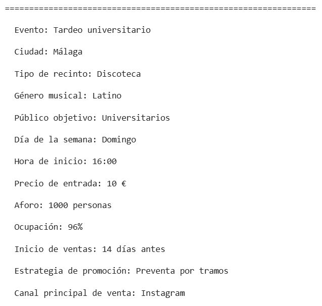
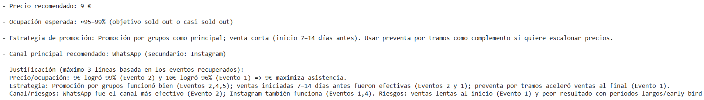

# 🎟️ AI Ticketing Advisor

Sistema **RAG (Retrieval-Augmented Generation)** orientado al sector del ticketing para ayudar a promotores de eventos a tomar decisiones de negocio a partir de eventos similares.

El proyecto genera un conjunto de datos sintético, crea embeddings mediante **Cohere**, almacena los vectores en **FAISS** y utiliza **GPT-5 mini** para generar recomendaciones fundamentadas en casos similares.

---

# 📌 Problema

Los promotores de eventos suelen enfrentarse a preguntas como:

* ¿Qué precio debería poner a las entradas?
* ¿Qué ocupación puedo esperar?
* ¿Cuándo debería abrir la preventa?
* ¿Qué estrategia de promoción suele funcionar mejor?
* ¿Qué canales de venta son los más efectivos?

Responder a estas preguntas únicamente por intuición puede provocar una baja ocupación o pérdidas económicas.

---

# 🎯 Objetivo

Desarrollar un sistema basado en **RAG** que, a partir de una consulta del promotor, recupere eventos similares y genere recomendaciones sobre:

* Precio recomendado.
* Ocupación esperada.
* Estrategia de promoción.
* Canal principal de venta.
* Justificación basada en eventos similares.

---

# 🛠 Tecnologías utilizadas

* Python
* Google Colab
* Pandas
* NumPy
* Cohere (`embed-multilingual-v3.0`)
* FAISS
* OpenAI GPT-5 mini
* LangChain
* Pickle

---

# 📁 Estructura del proyecto

```text
AI_Ticketing_Advisor/
│
├── data/
│   ├── events_dataset.csv
│   ├── documents.pkl
│   ├── event_embeddings.pkl
│   └── faiss_index.bin
│
├── images/
│   ├── retrieval_ejemplo.png
│   └── rag_ejemplo.png
│
├── notebooks/
│   ├── 01_creacion_dataset.ipynb
│   ├── 02_embeddings.ipynb
│   ├── 03_vector_stores.ipynb
│   ├── 04_retrieval.ipynb
│   └── 05_rag.ipynb
│
└── README.md
```

---

# ⚙️ Flujo del proyecto

```text
Consulta del usuario
        │
        ▼
Embeddings (Cohere)
        │
        ▼
FAISS Vector Store
        │
        ▼
Recuperación de eventos similares
        │
        ▼
GPT-5 mini
        │
        ▼
Recomendación final
```

---

# 🚀 Desarrollo

## 1. Creación del dataset

Se genera un dataset sintético de **2.500 eventos** con información relevante para el sector del ticketing:

* Ciudad
* Tipo de evento
* Tipo de recinto
* Género musical
* Público objetivo
* Precio
* Aforo
* Ocupación
* Estrategia de promoción
* Canal principal de venta
* Resultado del evento
* Observaciones comerciales

---

## 2. Conversión a documentos

Cada evento se transforma en un documento de texto para facilitar su representación semántica.

Ejemplo:

```text
Evento: Tardeo universitario

Ciudad: Málaga

Precio: 10 €

Aforo: 1000 personas

Ocupación: 96 %

...
```

---

## 3. Generación de embeddings

Los documentos se convierten en vectores utilizando el modelo **embed-multilingual-v3.0** de Cohere.

Los embeddings se almacenan para evitar tener que regenerarlos en futuras ejecuciones.

---

## 4. Vector Store

Los embeddings se indexan mediante **FAISS**, permitiendo realizar búsquedas semánticas rápidas y eficientes.

---

## 5. Retrieval

Cuando el usuario realiza una consulta, se genera su embedding y se recuperan los eventos más similares utilizando FAISS.

Ejemplo:

```text
Voy a organizar un tardeo universitario en Málaga para unas 1200 personas.
```
### Ejemplo de recuperación de eventos

A continuación se muestra un ejemplo de una consulta realizada por un promotor y el evento más similar recuperado por FAISS mediante búsqueda semántica.



---
## 6. RAG

Los eventos recuperados se utilizan como contexto para **GPT-5 mini**, que genera una recomendación basada únicamente en la información recuperada.

### Ejemplo de respuesta generada

Una vez recuperados los eventos más similares, GPT-5 mini utiliza ese contexto para generar una recomendación fundamentada sobre precio, ocupación esperada y estrategia de promoción.

La siguiente imagen muestra la recomendación generada por el sistema a partir de una consulta real.



---


# 🔮 Posibles mejoras

* Incorporar datos reales de ticketing.
* Añadir re-ranking de documentos.
* Implementar filtros por ciudad o fecha.
* Desarrollar una interfaz web con Streamlit.
* Exponer el sistema mediante una API con FastAPI.
* Desplegar el proyecto en la nube.

---

# 👨‍💻 Autor

**Francisco Rodríguez-Córdoba**

Proyecto desarrollado como práctica final del **módulo de Large Language Models**.
